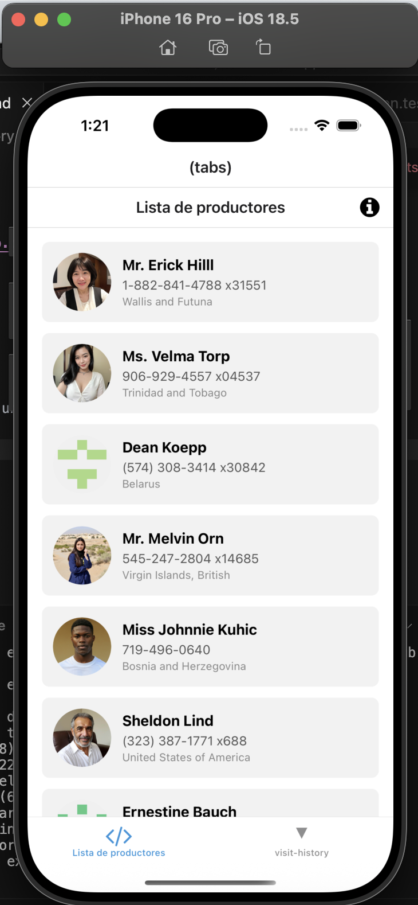
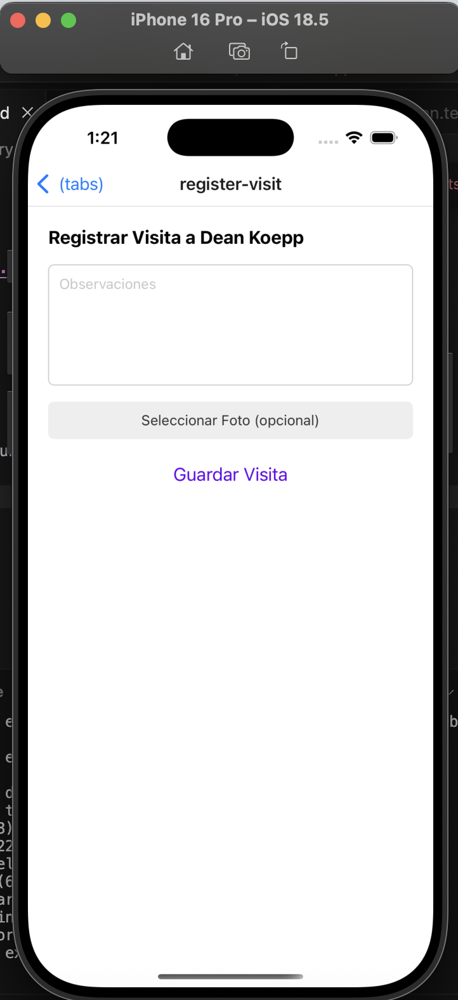
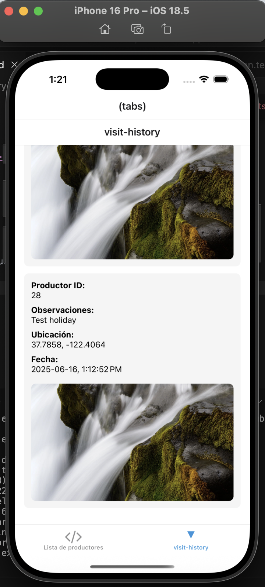

# 📋 Visit History App

Esta es una aplicación desarrollada con React Native que permite registrar visitas de usuarios a productores, guardar información localmente (cuando no hay conexión a internet) y sincronizar los datos automáticamente cuando se restablece la conexión. La pantalla de historial muestra tanto visitas online como offline.

## 🚀 Funcionalidades

- ✅ Listado de visitas realizadas (online y offline)
- 📥 Almacenamiento de visitas localmente usando AsyncStorage
- 🔄 Sincronización automática de visitas offline cuando vuelve la conexión
- 🖼 Visualización de detalles de cada visita:
  - Productor ID
  - Observaciones
  - Ubicación (latitud y longitud)
  - Fecha y hora
  - Foto (opcional)

## 🧱 Estructura del Proyecto

├── app/
│ └── (tabs)/
│ └── visit-history.tsx # Pantalla principal del historial
├── services/
│ └── visitService.ts # Lógica de API y almacenamiento offline
├── types/
│ └── index.ts # Definiciones de tipo (Visit)
├── test/
│ └── VisitHistoryScreen.test.tsx # Pruebas unitarias con Jest
└── ...


## 📦 Instalación

1. Clona el repositorio:

```bash
git clone https://github.com/steffanynaranjov/extensio-app.git
cd extensio-app
npm install

npm run ios
```
## 🧪 Ejecutar pruebas

Este proyecto usa Jest junto con Testing Library para pruebas unitarias:

```bash
npm run test
```

## Imagenes del proyecto

### pantalla principal







